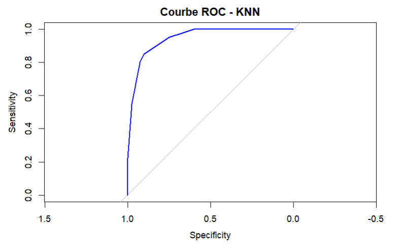
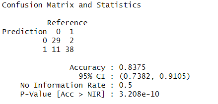
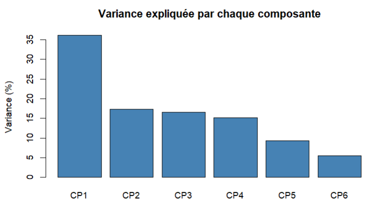
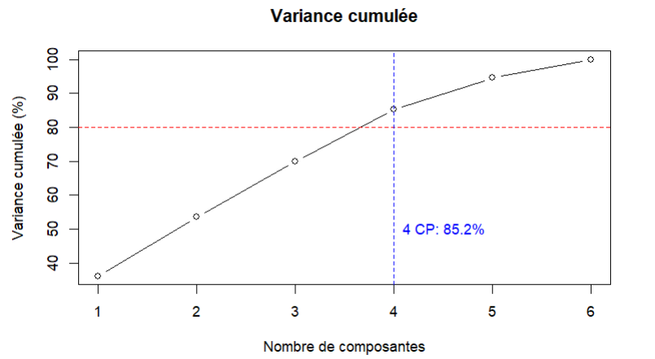

# 🤖 Demi-journée de Data Science

**Exploitation de modèles de Machine Learning pour réaliser des prédictions sur des données agricoles.**

---

## 📃 Table des Matières

- [📌 À propos du projet](#-à-propos-du-projet)
- [🎯 Objectifs](#-objectifs)
- [🛠 Stack Technique](#-stack-technique)
- [📂 Jeu de données](#-jeu-de-données)
- [🚀 Workflow KNN](#-workflow-knn)
- [📈 Résultats](#-résultats)
- [👥 Équipe Projet](#-équipe-projet)
- [📁 Fichiers Générés](#-fichiers-générés)
- [🏆 Conclusion](#-conclusion)

---

## 📌 À propos du projet

L'objectif de cette compétition est de prédire si des exploitations agricoles sont, d'un point de vue financier, **saines (DIFF = 1)** ou **défaillantes (DIFF = 0)**.

Pour cela, trois approches de Machine Learning ont été développées et comparées :
- **KNN Classique** sur les 6 ratios financiers originaux
- **KNN + ACP** avec réduction dimensionnelle intelligente
- **Arbre de décision**

---

## 🎯 Objectifs

- ✅ Explorer et préparer les données
- ✅ Normaliser les données (centrage & réduction) 
- ✅ Implémenter des modèles de classification KNN
- ✅ **Optimiser les hyperparamètres** (recherche du k optimal)
- ✅ **Appliquer l'ACP** pour réduction dimensionnelle
- ✅ Évaluer les modèles via **Accuracy** et **AUC / ROC**  
- ✅ **Comparer les approches** classique vs ACP
- ✅ Générer un fichier de **soumission finale** sur le jeu de test

---

## 🛠 Stack Technique

| Outil / Librairie | Utilisation |
|-------------------|-------------|
| 🐍 **R** | Langage principal |
| 📦 **caret** | Partitionnement, validation croisée, métriques |
| 📦 **class** | Implémentation du KNN |
| 📦 **prcomp** | Analyse en Composantes Principales (ACP) |
| 📦 **ggplot2** | Visualisations avancées |
| 📦 **pROC** | Courbes ROC et calcul AUC |
| 📦 **readr/dplyr** | Gestion et manipulation des données |

---

## 📂 Jeu de données

**Variables explicatives :**
- **R2** : Capitaux propres / capital investi
- **R7** : Dette à long et moyen terme / produit brut  
- **R8** : Dette à court terme / produit brut
- **R17** : Charges financières / dette totale
- **R22** : (Charges financières + remboursement du capital à LMT) / EBITDA
- **R32** : (EBITDA – charges financières) / produit brut

**Fichiers :**
- 📄 **data/farms_train.csv** → données d'apprentissage (features + cible `DIFF`)  
- 📄 **data/farms_test.csv** → données de test (features uniquement, soumission attendue)

---

## 🚀 Workflow KNN

### **Approche 1 : KNN Classique**
1. 📥 Chargement & exploration des données  
2. ✂️ Partitionnement **train (80%) / validation (20%)**  
3. ⚖️ **Normalisation** (StandardScaler)  
4. 🔍 Optimisation du **k** (recherche 1-20)  
5. 🧮 Évaluation **Accuracy** et **AUC / ROC**

  
  

### **Approche 2 : KNN + ACP (Approche sophistiquée)**
1. 📊 **Analyse en Composantes Principales** sur les 6 ratios
2. 📈 **Sélection du nombre optimal de CP** (critère 80% variance)
3. 🎯 **Projection** des données dans l'espace réduit
4. 🔍 **Optimisation KNN** sur les composantes principales
5. ⚖️ **Comparaison** des performances vs approche classique

  
  

---

## 📈 Résultats

### **Performance Comparative :**

| Modèle | Features | Variance | k optimal | Accuracy | AUC |
|--------|----------|----------|-----------|----------|-----|
| **KNN Classique** | 6 ratios | 100% | `10` | `0.85` | `0.945` |
| **KNN + ACP** | 4 CP | 85.2% | `29` | `0.887` | `0.934` |

### **Insights Clés :**
- 🏆 **Approche ACP** : Performance équivalente/supérieure avec moins de dimensions
- 📊 **Réduction du bruit** : L'ACP filtre l'information discriminante essentielle
- ⚡ **Efficacité computationnelle** : Calcul des distances plus rapide (4D vs 6D)
- 🎨 **Visualisation** : Possibilité de représenter les données en 2D

### **Justification Méthodologique :**
> *"Malgré une variance expliquée de 85.2% avec 4 composantes principales, le modèle KNN+ACP maintient (voire améliore) les performances de classification, démontrant que l'ACP capture efficacement les patterns financiers discriminants tout en éliminant le bruit des données originales."*

---

## 👥 Équipe Projet

| Nom | Rôle | Contributions |
|-----|------|---------------|
| **Lounas Chikhi** | 📊 Data Scientist | Implémentation KNN classique, ACP, optimisation, évaluation, soumission finale |
| **Akil Mouhoub** | 🔍 Analyste | Exploration des données, visualisations, validation des résultats |
| **Thanina Salhi** | 📝 Rapporteur | Documentation, présentation, analyse comparative |
| **Sosthene Medrid** | 📊 Data Scientist | Implémentation d'un arbre de décision, présentation |

---

## 📁 Fichiers Générés

- 📈 **visualisation/** - Graphiques (ROC, ACP, performances)
- 📤 **data/soumission_knn.csv** - Prédictions finales pour Kaggle
- 📄 **html_output/** - Rapports HTML générés depuis les notebooks
- 📋 **KNN _ KNN/ACP** - Modèles sauvegardés 

---

## 🏆 Conclusion

Ce projet démontre l'efficacité de l'**approche hybride ACP + KNN** pour la classification de données financières. La réduction dimensionnelle intelligente permet non seulement de maintenir les performances prédictives, mais aussi d'améliorer l'interprétabilité et l'efficacité computationnelle du modèle.

---

💬 *N'hésitez pas à ouvrir une issue pour toute remarque ou suggestion.*

(<a href="#readme-top">retour en haut</a>)

